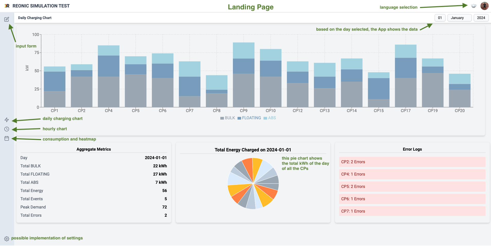
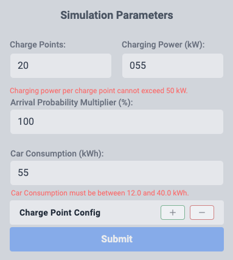
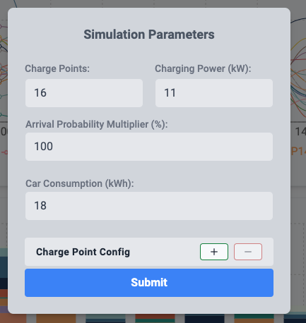
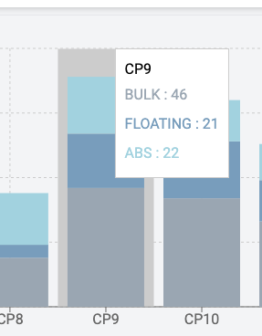
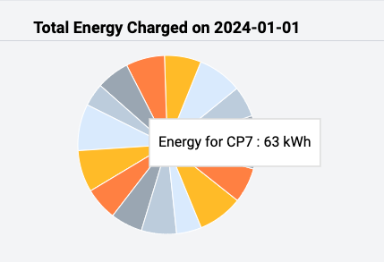
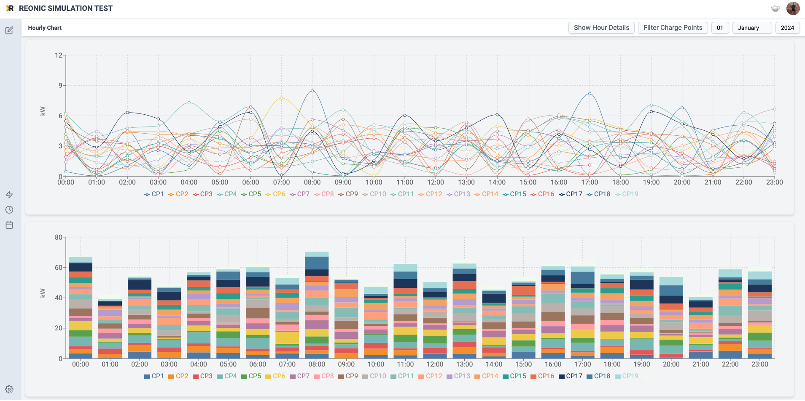
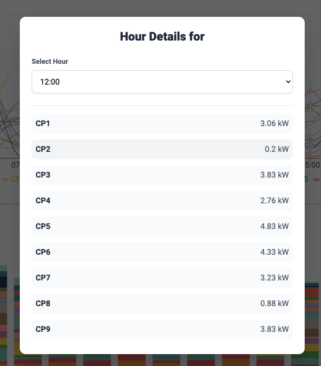
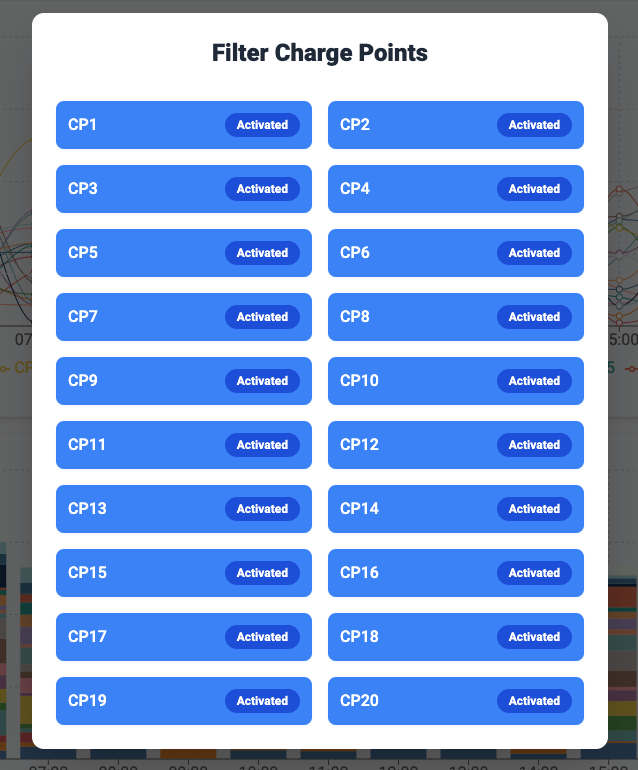
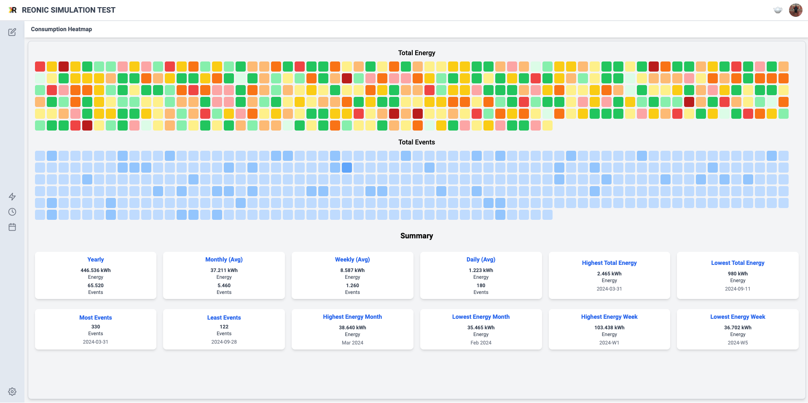

# Reonic Simulation Test

This project is a frontend application designed to simulate the charging of electric cars in a shop parking lot. Users can input various parameters to observe how different configurations affect the charging process.

## Features

- **Simulation Parameters**: Configure the number of charging points, arrival probability of cars, car consumption (in kWh), and charging power per charging point (in kW).
- **Dynamic Data Generation**: Simulate charging events based on user inputs.
- **Responsive Design**: Optimized for various screen sizes using Tailwind CSS:
  - Wide Screen;
  - MacBook Pro 13";
  - iPad Pro;
  - iPhone 14 Pro Max.
- **Translation**: Supporting English, German and Italian languages.

## Technologies Used

- **React**: A JavaScript library for building user interfaces.
- **TypeScript**: A typed superset of JavaScript that compiles to plain JavaScript.
- **Tailwind CSS**: A utility-first CSS framework for rapid UI development.

## Getting Started

Follow these steps to set up the project locally:

1. **Clone the repository**:

   ```bash
   git clone https://github.com/matteobu/reonic.git
   ```

2. **Navigate to the project directory**:

   ```bash
   cd reonic
   ```

3. **Install dependencies**:

   ```bash
   npm install
   ```

4. **Create the mocked data**:

   ```bash
   cd src/mocks
   node generateData.mjs
   ```

   The application should now have the mocked data in the folder `src/mocks`.

5. **Start the development server**:

   ```bash
   npm start
   ```

   The application should now be running at `http://localhost:3000`.

## Usage

1. **Configure Simulation Parameters**: Adjust the input fields to set the number of charging points, arrival probability, car consumption, and charging power.
2. **View Results**: Analyze the output, including total energy charged, number of charging events, and heatmaps of consumed energy.

## Assumptions

- Each car requires a charging duration proportional to its consumption and the charging power of the station.

## License

This project is licensed under the MIT License. See the [LICENSE](LICENSE) file for details.

## Acknowledgements

This project was developed as part of a frontend task for Reonic.

## Web App Preview

## Landing Page

This is the landing page displayed when `npm start` is run.

### HeadBar

The **HeadBar** features:

- The application's name on the left.
- A language selector and a link to the repository on the right.

### SideBar

The **SideBar** contains:

- Four functional buttons, including the **InputForm** at the top.
- Three icons linking to the main components:
  - **Daily Chart**
  - **Hourly Chart**
  - **Consumption Heatmap**



### Input for Simulation

The **Input Form** allows users to configure the parameters for the simulation. It includes four main inputs:

- **Charge Points**: A value between `1` and `20`, default is `20`.
- **Charging Power**: A value between `1` and `11` (kW), default is `11`.
- **Arrival Probability Multiplier**: A percentage between `20%` and `200%`, default is `100%`.
- **Car Consumption**: A value between `12.0` and `40.0` (kWh), default is `18`.

If any input value falls outside the predefined range, an error message will be displayed in the form, such as:

- `Car Consumption must be between 12.0 and 40.0 kWh`.


The **Submit Button** becomes enabled only when all inputs meet the required conditions (i.e., all values are within the valid ranges).



### Additional Customization


The form includes two buttons: `+` and `-`. These allow users to add or remove configurations for multiple Charge Points (CPs). Users can customize configurations, such as:

- `5 CPs × 10 kW + 3 CPs × 5 kW + 1 CP × 30 kW`.

### Limits and Constraints

The customization is subject to the following limits:

1. **Maximum Charge Points (CPs)**: The total number of CPs cannot exceed `20`.
2. **Maximum Total Charging Power**: The combined charging power cannot exceed `220 kW`.

This ensures the simulation remains within realistic and manageable bounds.



### Daily Tooltip



### Languages


### Total Energy Pie



### Hourly Chart



### Hourly Chart Details



### Filter Charge Points



### Consumption Heatmap


